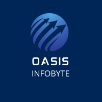

 

<h1 align="center">Cybersecurity Internship Tasks</h1>

 
 
 
 
 
 

---
## About
This repository documents my hands-on work during the **Security Analyst Internship** at **Oasis Infobyte**.
Each task covers a core cybersecurity skill — network reconnaissance, firewall hardening, web vulnerability scanning, and t
**Intern:** Ratham Bhagat
**Role:** Security Analyst Intern
**Internship Period:** June 2025
**Platform:** WSL Ubuntu 22.04 + Neovim (LazyVim)
---
## Tasks
| # | Task | Tool | Description | Folder |
|---|------|------|-------------|--------|
| 1 | Network Scanning | Nmap | Scanned localhost to identify open ports and running services | [task1_nmap](./task1_nmap/)
| 2 | Firewall Configuration | UFW / iptables | Configured host-based firewall rules for basic hardening | [task2_ufw](./ta
| 7 | Vulnerability Scanning | Nikto | Ran a web server vulnerability scan against a local target | [task7_nikto](./task7_n
| 8 | Packet Capture & Analysis | tshark / Wireshark | Captured live network traffic and filtered HTTP packets | [task8_wir
---
## Skills Demonstrated
- Network port and service enumeration
- Host-based firewall rule management
- Automated web vulnerability detection
- Packet capture and traffic analysis
- Linux CLI proficiency (WSL Ubuntu)
- Security documentation and reporting
---
## Repository Structure
Each task folder contains:
- `README.md` — task overview, commands, results, how to reproduce
- `commands.md` — all exact commands used
- `images/` — annotated screenshots
- Result files (`.txt`, `.pcap`)
