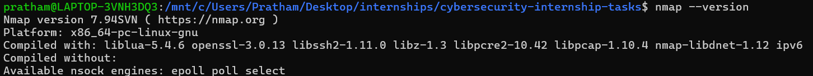
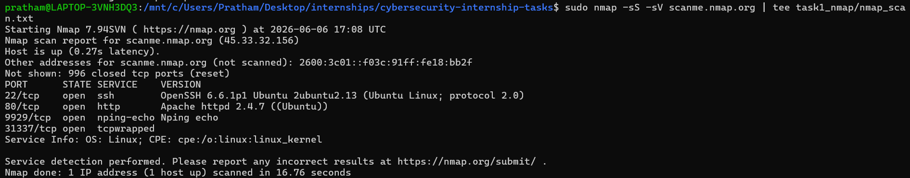

# Task 1 – Network Scanning with Nmap

## Objective
Use Nmap to perform a TCP SYN scan on localhost, identify open ports, and enumerate running services.
## Environment
- OS: Ubuntu 22.04 (WSL2)
- Tool: Nmap 7.x
## Installation
```bash
sudo apt update && sudo apt install -y nmap
```
## Commands Used
```bash
sudo nmap -sS -sV scanme.nmap.org | tee nmap_scan.txt
```

## Results
See `nmap_scan.txt` for full output. Key findings:

| Port | State | Service | Version |
|------|-------|---------|---------|
| **22/tcp** | open | ssh | OpenSSH 6.6.1p1 Ubuntu 2ubuntu2.13 |
| **80/tcp** | open | http | Apache httpd 2.4.7 ((Ubuntu)) |
| **9929/tcp** | open | nping-echo | Nping echo |
| **31337/tcp** | open | tcpwrapped | - |

## Key Takeaway
Even on a development machine, unexpected open ports can be an attack surface. This scan helps establish a baseline of what services should and should not be running.

## Screenshots



## Videos


## How to Reproduce
```bash
sudo apt install nmap
sudo nmap -sS -sV scanme.nmap.org | tee task1_nmap/nmap_scan.txt
```
