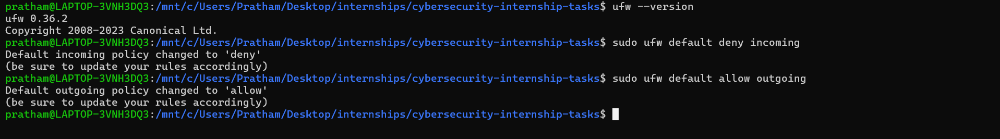
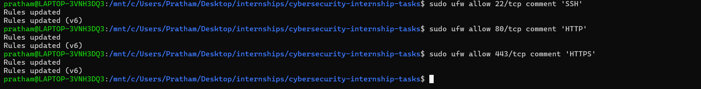
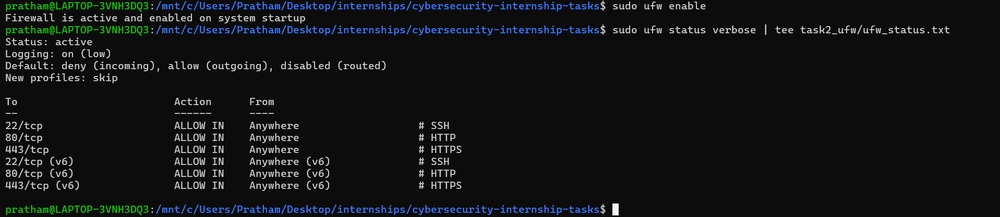

# Task 2 – Firewall Configuration with UFW

## Objective
Set up a basic firewall using UFW (Uncomplicated Firewall) on a Linux system. Configure the firewall to allow SSH and deny HTTP traffic.

## Environment
- OS: Ubuntu 22.04 (WSL2)
- Tool: UFW (Uncomplicated Firewall)

> **Note:** UFW in WSL2 shows rule configuration but kernel-level enforcement requires a full Linux environment. The configuration steps and logic demonstrated here apply directly to any production Ubuntu server.

## Commands Used
```bash
sudo ufw default deny incoming
sudo ufw default allow outgoing
sudo ufw allow 22/tcp comment 'SSH'
sudo ufw deny 80/tcp comment 'Deny HTTP'
sudo ufw enable
sudo ufw status verbose | tee ufw_status.txt
```

## Firewall Rules Configured

| Port | Protocol | Policy | Reason |
| :--- | :--- | :--- | :--- |
| Default | All | DENY IN | Block all unsolicited traffic |
| 22 | TCP | ALLOW | Secure shell access required for remote management |
| 80 | TCP | DENY | Explicitly block unencrypted web traffic per task requirements |

## Key Takeaway
Configuring explicit block rules (like denying port 80) alongside a default-deny policy ensures that legacy or insecure protocols cannot be accidentally exposed, forcing secure connections (like SSH).

## Screenshots




## Videos 

## How to Reproduce
```bash
sudo apt install ufw
sudo ufw default deny incoming && sudo ufw default allow outgoing
sudo ufw allow 22/tcp && sudo ufw deny 80/tcp
sudo ufw enable && sudo ufw status verbose
```

```
