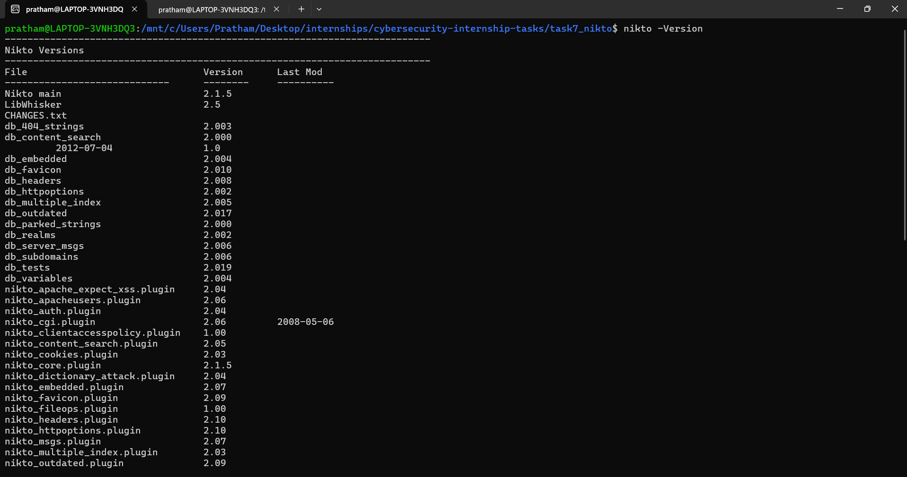

# Task 7 - Web Vulnerability Scanning with Nikto
## Objective
Use Nikto to perform an automated vulnerability scan against a local web server and interpret the findings.
## Environment
- OS: Ubuntu 22.04 (WSL2)
- Tool: Nikto 2.x
- Target: Python3 HTTP server on localhost:8080
## Setup
Start a local target web server:
```bash
mkdir -p /tmp/webroot && echo "<h1>Test</h1>" > /tmp/webroot/index.html
cd /tmp/webroot && python3 -m http.server 8080 &
```
## Commands Used
```bash
nikto -h http://localhost:8080 | tee nikto_scan.txt
```
## Key Findings
| Finding | Severity | Description |
|---------|----------|-------------|
| Missing X-Frame-Options header | Low | Allows potential clickjacking |
| Server version disclosure | Informational | Python/3.x.x revealed in HTTP header |
| No HTTPS | Medium | Traffic is unencrypted |
| (add your actual findings here) | | |
## Key Takeaway
Automated scanners like Nikto can quickly surface common misconfigurations and missing security headers that would otherwis
## Screenshots



## How to Reproduce
```bash
sudo apt install nikto
python3 -m http.server 8080 &
nikto -h http://localhost:8080 | tee nikto_scan.txt
```

